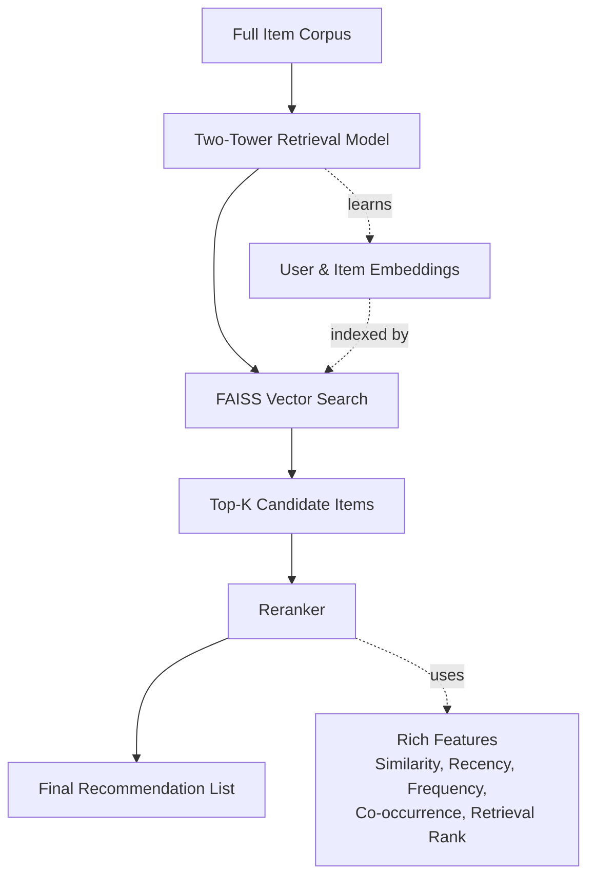

# Two-Stage Recommendation System (Two-Tower Retrieval + FAISS + Reranking)

This repo implements an end-to-end **two-stage recommender** for **implicit feedback** (Amazon Electronics reviews):
1) **Retrieval**: a **two-tower** model learns user/item embeddings and retrieves Top-K candidates with **FAISS**.
2) **Reranking**: a lightweight **Learning-to-Rank** model (LightGBM LambdaRank) reranks retrieved candidates using interaction features (recency/frequency/co-occurrence) + tower similarity.

The pipeline is designed with **strict time-based splits** to avoid data leakage and supports reproducible offline evaluation.

---

## Table of Contents
- [Two-Stage Recommendation System (Two-Tower Retrieval + FAISS + Reranking)](#two-stage-recommendation-system-two-tower-retrieval--faiss--reranking)
  - [Table of Contents](#table-of-contents)
  - [Project Overview](#project-overview)
    - [General Framework](#general-framework)
    - [Stage 1 — Retrieval (Two-Tower + FAISS)](#stage-1--retrieval-two-tower--faiss)
    - [Stage 2 — Reranking (LightGBM/MLP)](#stage-2--reranking-lightgbmmlp)
  - [Dataset](#dataset)
  - [Evaluation Metric](#evaluation-metric)
    - [What Does `Retrieval Hit Rate@500` Mean?](#what-does-retrieval-hit-rate500-mean)
- [\\text{HitRate@500}](#texthitrate500)
  - [Environment Setup](#environment-setup)
    - [Python environment](#python-environment)
  - [Running Commands](#running-commands)
    - [Standard Results and Analysis](#standard-results-and-analysis)
      - [1. Dataset Scale and Time-Based Split](#1-dataset-scale-and-time-based-split)
      - [Running ***two\_tower\_train.py***](#running-two_tower_trainpy)
      - [Running ***faiss\_eval.py***](#running-faiss_evalpy)
      - [Running ***rerank.py***](#running-rerankpy)
      - [Running ***rerank\_train\_lgbm***](#running-rerank_train_lgbm)
    - [Main Bottleneck](#main-bottleneck)

---

## Project Overview
The recommendation system follows a two-stage architecture.  
A fast retrieval model first narrows down the full item corpus into a compact Top-K candidate set, and a reranker then refines the ordering using richer behavioral and contextual features.

### General Framework


### Stage 1 — Retrieval (Two-Tower + FAISS)
- Learns embeddings:
  - user embedding: `u ∈ R^d`
  - item embedding: `v ∈ R^d`
- Similarity score (typical): dot product / cosine similarity
  - With L2-normalized embeddings, inner product equals cosine similarity.
- Uses **FAISS** to retrieve **Top-K** candidates efficiently.

### Stage 2 — Reranking (LightGBM/MLP)
- Trains a model over (user, candidate item) pairs using features:
  - tower similarity score (`sim`)
  - recency, frequency, co-occurrence, retrieval rank, etc.
- Optimizes ranking metrics like **NDCG@K**.

---

## Dataset

We use **Amazon Reviews (2018)**, category: **Electronics** (5-core subset, `Electronics_5.json.gz`). **Streaming reading** is applied to transfer the data from gzip files to pandas.dataframe efficiently.

Fields used:
- `reviewerID` → `user_id`
- `asin` → `item_id`
- `unixReviewTime` → `timestamp`
- `overall` → rating (converted into implicit positives)

Implicit-positive rule used in our runs:
- `rating >= 4` → positive interaction

---
## Evaluation Metric

### What Does `Retrieval Hit Rate@500` Mean?

`Retrieval Hit Rate@500` measures the proportion of evaluated user queries for which the user's true next-interaction item appears in the Top-500 candidate items retrieved by FAISS.

In other words:

$$
\text{HitRate@500}
=
\frac{
\left|\{u: i_u^{\text{true}} \in \text{Top500}(u)\}\right|
}{
\left|\{u\}\right|
}
$$

where:

- $u$: a user, which can also be viewed as a query.
- $\text{Top500}(u)$: the 500 candidate items retrieved by the Two-Tower model + FAISS for user $u$.
- $i_u^{\text{true}}$: the item that user $u$ actually interacted with next in the validation/test set.

Therefore, this metric answers the question:

> Did the first-stage retrieval model successfully retrieve the true target item?

---
## Environment Setup

### Python environment
Recommended: conda env (macOS friendly)
```bash
conda create -n llm python=3.10 -y
conda activate llm
pip install pandas numpy tqdm scikit-learn torch lightgbm
conda install -y -c conda-forge llvm-openmp faiss-cpu
```

## Running Commands
```bash
python -m src.data
python -m src.two_tower_train
python -m src.faiss_eval
python -m src.rerank
python -m src.rerank_train_lgbm
```

### Standard Results and Analysis

#### 1. Dataset Scale and Time-Based Split

The dataset was constructed from approximately **2 million Amazon Electronics review interactions** and converted into implicit-feedback events using the rule:

```text
rating >= 4  => positive interaction
```
The split follows a strict per-user time-based protocol:

a. Earlier interactions are used for training.
b. The second-last interaction is used for validation.
c. The last interaction is used for testing.

This setup is important because recommendation is naturally a temporal prediction problem. The model should predict future user behavior from past interactions only. A random split would risk data leakage and could overstate performance.

#### Running ***two_tower_train.py***
```text
Reading reviews: 1999999it [00:12, 154828.57it/s]
Users=94318 Items=35149 Train=549532 Val=93438 Test=93305
Epoch 1: loss=8.5546  Recall@50≈0.0195 (on 2k users)
Epoch 2: loss=4.7251  Recall@50≈0.0320 (on 2k users)
Epoch 3: loss=3.6643  Recall@50≈0.0375 (on 2k users)
Saved -> .../two_tower.pt
```

The two-tower retrieval model learns user and item embeddings and scores candidate items using embedding similarity.

The loss decreases from 8.5546 to 3.6643, which shows that the model is learning to distinguish positive user-item pairs from in-batch negatives. The sampled Recall@50 also improves from 0.0195 to 0.0375, indicating that retrieval quality improves during training.

However, the absolute Recall@50 is still modest. This is expected because the current retrieval model is a relatively simple baseline based on user/item ID embeddings. It does not yet use richer signals such as product metadata, item text, user history pooling, sequence modeling, or hard negative mining.

The main role of this stage is not perfect ranking, but scalable candidate generation.

#### Running ***faiss_eval.py***
```text
Eval users=93305 items=35149 dim=64
[FAISS FlatIP] Recall@50=0.0343  time=7.858s
[FAISS HNSW]  Recall@50=0.0343  time=5.697s  (efSearch=64)
```
At the current scale of 35,149 items, exact FlatIP search is still feasible. However, HNSW becomes more valuable when the catalog scales to hundreds of thousands or millions of items.

#### Running ***rerank.py***
```text
Users=94318 Items=35149 Train=549532 Val=93438 Test=93305
Build rerank rows K=500: 100%|████████████████████████| 92/92 [04:09<00:00,  2.71s/it]
Saved -> .../outputs/rerank_train_k500.csv
Rows: 46,793,252
Positive rows: 93,438
Retrieval hit rate@500: 0.2053
append_positive=True
Build rerank rows K=500: 100%|████████████████████████| 92/92 [04:56<00:00,  3.22s/it]
Saved -> .../outputs/rerank_test_k500.csv
Rows: 46,652,500
Positive rows: 6,671
Retrieval hit rate@500: 0.0715
append_positive=False
```
The reranker dataset is built from Top-500 candidates retrieved by FAISS.

Each row corresponds to a (user, candidate item) pair and includes features such as:
```text
retrieval_rank
user_freq
item_freq
ui_freq
ui_recency_days
cooc_with_last
gap_from_last_event_days
```
These features give the reranker richer information than the two-tower similarity score alone.

#### Running ***rerank_train_lgbm***
```text
Loading reranker data...
Raw train rows: 46,793,252, users: 93,438
Raw test rows:  46,652,500, users: 93,305

After leakage-safe filtering:
Train rows: 9,593,000, users with positive: 19,186
Test rows:  46,652,500, users total: 93,305
Test conditional rows: 3,335,500, users with positive: 6,671

Retrieval HitRate@500 on test: 0.0715

Training LightGBM LambdaRank...
Training until validation scores don't improve for 100 rounds
[50]	test_conditional's ndcg@10: 0.546938	test_conditional's ndcg@50: 0.587722
[100]	test_conditional's ndcg@10: 0.552622	test_conditional's ndcg@50: 0.592286
[150]	test_conditional's ndcg@10: 0.553324	test_conditional's ndcg@50: 0.592563
[200]	test_conditional's ndcg@10: 0.552188	test_conditional's ndcg@50: 0.591533
Early stopping, best iteration is:
[124]	test_conditional's ndcg@10: 0.554081	test_conditional's ndcg@50: 0.593672

Scoring...

=== Test Results ===
Unconditional metrics include users where retrieval missed the true item.
LambdaRank full test         NDCG@10=0.0396  NDCG@50=0.0424  Recall@50=0.0601
TwoTower sim full test       NDCG@10=0.0139  NDCG@50=0.0161  Recall@50=0.0343

Conditional metrics only include users where true item is in Top-500 candidates.
LambdaRank conditional       NDCG@10=0.5541  NDCG@50=0.5937  Recall@50=0.8407
TwoTower sim conditional     NDCG@10=0.1947  NDCG@50=0.2251  Recall@50=0.4791

=== Feature Importance ===
                 feature  importance_gain  importance_split
          cooc_with_last     2.248614e+06               934
         ui_recency_days     4.479042e+05               625
               item_freq     3.930282e+05              2287
gap_from_last_event_days     7.001775e+04               951
                     sim     6.034356e+04               980
          retrieval_rank     3.005919e+04               838
                 ui_freq     2.155507e+04               544
               user_freq     7.125664e+03               529

Saved -> .../outputs/reranker_lgbm.txt
```

For training, append_positive=True means that if the true validation item was not retrieved by FAISS, it was manually appended to the candidate set.

This is useful for training because ranking models such as LambdaRank need groups with positive examples. If a user group contains only negative candidates, it provides little ranking signal.

However, these appended positives are artificial training examples. They should not be used for final test evaluation because they would leak the true answer into the candidate set.

The reranker improves ranking because it combines neural retrieval scores with tabular behavioral signals that the two-tower model does not explicitly capture.

### Main Bottleneck
The main bottleneck is the first-stage retrieval model.

The leakage-safe test retrieval hit rate is:
```text
Retrieval HitRate@500 = 0.0715
```
This means that only 7.15% of true test items are available to the reranker.

Therefore, even a very strong reranker cannot fully compensate for weak candidate generation. If the true item is not retrieved, the second-stage model cannot rank it.

The likely reasons are:

(i) The current user tower uses simple user & item ID embeddings.
(ii) No user history pooling is used.
(ii) No product metadata is included.
(iv) No item title, category, brand, or text features are included.
(v) No sequential recommendation structure is modeled.
(vi) The retrieval model uses a relatively simple in-batch-negative setup.

The current system successfully demonstrates the two-stage architecture, but **retrieval recall is the main area for future improvement**.